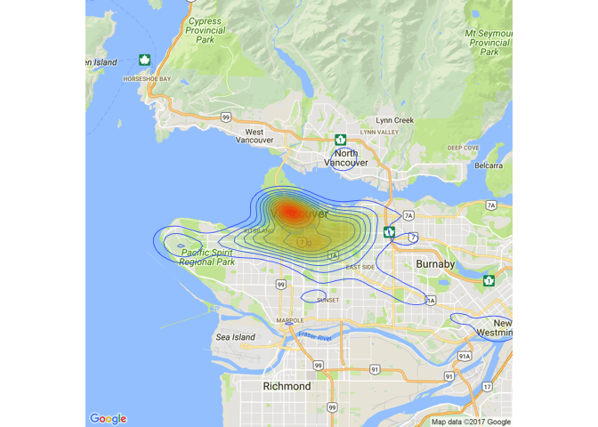

# Launch_Dates_Map1


```
## Loading required package: ggplot2
```

```
## Map from URL : http://maps.googleapis.com/maps/api/staticmap?center=vancouver&zoom=11&size=640x640&scale=2&maptype=roadmap&language=en-EN&sensor=false
```

```
## Information from URL : http://maps.googleapis.com/maps/api/geocode/json?address=vancouver&sensor=false
```

```
## Warning: `panel.margin` is deprecated. Please use `panel.spacing` property
## instead
```

```
## Warning: Removed 91 rows containing missing values (geom_point).
```

<!-- -->

```
## Warning: `panel.margin` is deprecated. Please use `panel.spacing` property
## instead
```

```
## Warning: Removed 91 rows containing non-finite values (stat_density2d).

## Warning: Removed 91 rows containing non-finite values (stat_density2d).
```

<!-- -->

