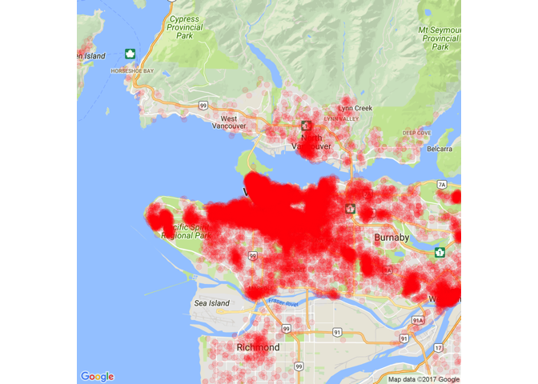
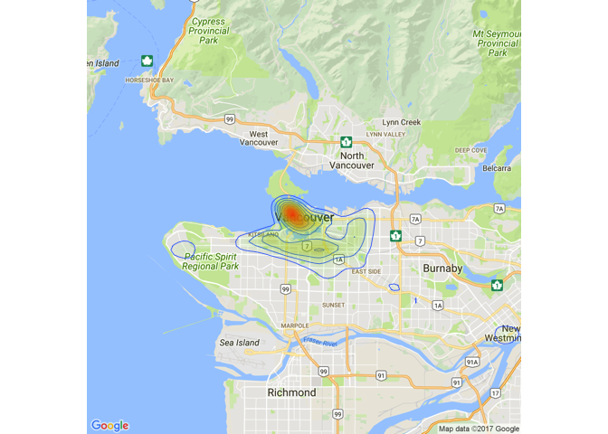

# Members_Map1


```r
library(ggmap)
```

```
## Loading required package: ggplot2
```

```r
library(ggplot2)

members_table=read.csv("Datasets/Member_geohashes_Table1.csv") #load the launch dates data table

vancouver_map=get_map(location="vancouver", maptype="roadmap", zoom=11) #create the map
```

```
## Map from URL : http://maps.googleapis.com/maps/api/staticmap?center=vancouver&zoom=11&size=640x640&scale=2&maptype=roadmap&language=en-EN&sensor=false
```

```
## Information from URL : http://maps.googleapis.com/maps/api/geocode/json?address=vancouver&sensor=false
```

```r
ggmap(vancouver_map, extent = "device")+geom_point(aes(x = Longitude, y = Latitude), colour = "red", alpha = 0.1, size = 2, data = members_table)
```

```
## Warning: `panel.margin` is deprecated. Please use `panel.spacing` property
## instead
```

```
## Warning: Removed 7098 rows containing missing values (geom_point).
```

<!-- -->

```r
ggmap(vancouver_map, extent = "device")+
geom_density2d(data=members_table,aes(x=Longitude,y=Latitude), size=0.3)+
stat_density2d(data=members_table,aes(x=Longitude,y=Latitude,fill=..level..,alpha=..level..),size=0.01,bins=24,geom="polygon")+
scale_fill_gradient(low="green",high="red",guide=FALSE)+scale_alpha(range=c(0,0.3),guide=FALSE)
```

```
## Warning: `panel.margin` is deprecated. Please use `panel.spacing` property
## instead
```

```
## Warning: Removed 7098 rows containing non-finite values (stat_density2d).

## Warning: Removed 7098 rows containing non-finite values (stat_density2d).
```

<!-- -->

